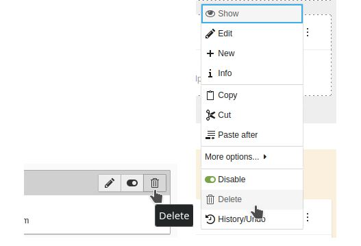

# Work in Progress

...





# How to

## Installation

### If you want to test the patch locally, use the following ddev option

Please update your ddev before you continue. (You need composer v2.2+ and up-to-date nginx config to run TYPO3v11)

```shell
mkdir my-typo3-site
cd my-typo3-site
ddev config --project-type=typo3 --docroot=public --create-docroot
ddev start
ddev composer create "typo3/cms-base-distribution:^11"
ddev composer config allow-plugins.cweagans/composer-patches true
ddev composer config extra.enable-patching true
ddev composer require typo3-ux/page-module-pilot
# make sure composer-patches can do its stuff
ddev composer update --lock
ddev exec touch public/FIRST_INSTALL
ddev launch
```

### If you want to use the patch, you have two options

1. Option use composer package in your composer-installed TYPO3 v11.5.x

```shell
composer config allow-plugins.cweagans/composer-patches true
composer config extra.enable-patching true
composer require typo3-ux/page-module-pilot
# make sure composer-patches can do its stuff
composer update --lock
```

2. Option use the new TYPO3 Core Patches extension 

Follow the installation guide https://github.com/GsTYPO3/core-patches/blob/main/README.md#installation

TYPO3 v11.5.x Projects
```shell
composer typo3:patch:apply 73100
```
TYPO3 v12.x Projects
```shell
composer typo3:patch:apply 71965
```

## Remove Patch

### 1. in your composer-installed TYPO3 v11.5.x:

```shell
composer remove typo3-ux/page-module-pilot
composer config --unset extra.enable-patching
rm -rf public/typo3/ && composer install
```

### 2. with core patches extension

TYPO3 v11.5.x Projects
```shell
composer typo3:patch:remove 73100
```
TYPO3 v12.x Projects
```shell
composer typo3:patch:remove 71965
```
